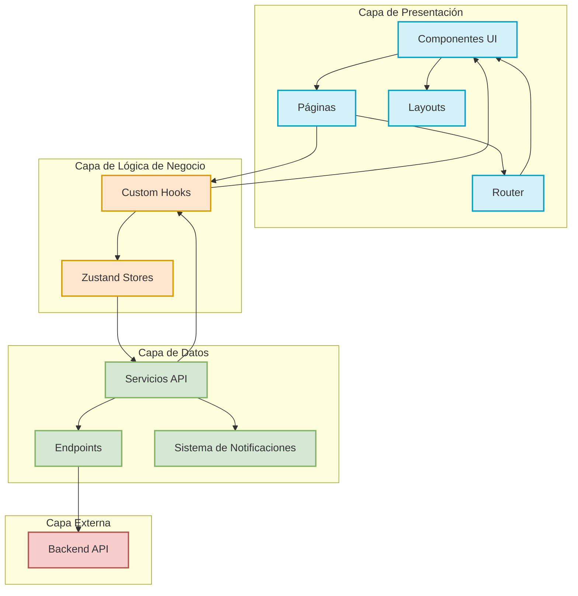
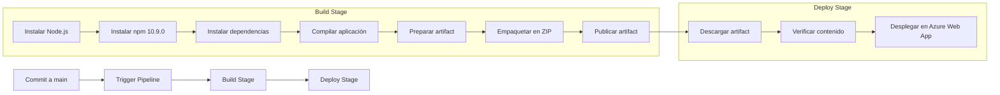

# EquirentAppAdminFrontend

## Descripción General

EquirentAppAdminFrontend es una aplicación web administrativa para la gestión de la plataforma Equirent Mobility. Esta aplicación permite a los administradores gestionar usuarios, consultas, servicios, guías y pagos relacionados con el servicio de movilidad Equirent.

La aplicación está construida utilizando React, TypeScript y Vite, con un enfoque en componentes reutilizables y una arquitectura modular. Utiliza Zustand para la gestión del estado global y React Router para la navegación.

## Tecnologías Principales

- **React 19**: Framework de UI
- **TypeScript**: Lenguaje de programación tipado
- **Vite**: Herramienta de construcción y desarrollo
- **Zustand**: Gestión de estado global
- **React Router 7**: Enrutamiento
- **Material UI 6**: Componentes de UI
- **Axios**: Cliente HTTP para peticiones API
- **Jest**: Framework de testing
- **Testing Library**: Utilidades para testing de componentes

## Arquitectura de la Aplicación

La aplicación sigue una arquitectura modular basada en componentes con gestión de estado centralizada mediante Zustand y comunicación con API REST.



### Flujo de Datos

1. **Interacción del Usuario**: El usuario interactúa con los componentes UI en las páginas.

2. **Manejo de Eventos**: Los eventos del usuario son capturados por los componentes y procesados por los custom hooks.

3. **Gestión de Estado**: Los custom hooks actualizan el estado global a través de los stores de Zustand.

4. **Comunicación con API**: Los servicios API realizan peticiones al backend utilizando Axios.

5. **Notificaciones**: El sistema de notificaciones proporciona feedback al usuario sobre el resultado de las operaciones.

6. **Actualización de UI**: Los cambios en el estado global provocan la re-renderización de los componentes afectados.

### Patrones de Diseño

- **Container/Presentational**: Separación entre lógica (custom hooks) y presentación (componentes UI).

## Estructura del Proyecto

### Estructura General

```
/
├── public/               # Archivos estáticos
├── src/                  # Código fuente principal
├── tests/                # Tests unitarios y de integración
├── coverage/             # Informes de cobertura de tests
├── dist/                 # Build de producción
├── vite.config.ts        # Configuración de Vite
├── tsconfig.json         # Configuración de TypeScript
├── jest.config.js        # Configuración de Jest
└── package.json          # Dependencias y scripts
```

## Estructura de la Carpeta `src`

La carpeta `src` contiene todo el código fuente de la aplicación y está organizada de la siguiente manera:

### Componentes Principales

```
src/
├── assets/               # Imágenes, iconos y recursos estáticos
├── components/           # Componentes reutilizables
├── customHooks/          # Hooks personalizados
├── layouts/              # Layouts de la aplicación
├── pages/                # Páginas principales
├── router/               # Configuración de rutas
├── services/             # Servicios API y endpoints
├── store/                # Stores de Zustand para estado global
├── styles/               # Estilos globales
├── types/                # Definiciones de tipos TypeScript
├── App.tsx               # Componente principal de la aplicación
└── main.tsx              # Punto de entrada de la aplicación
```

### Desglose Detallado

#### `/components`

Contiene todos los componentes reutilizables organizados por funcionalidad:

- **buttons/**: Componentes de botones (Button, IconButton)
- **confirmationModal/**: Modal de confirmación para acciones importantes
- **filters/**: Componentes para filtrado de datos
- **guideCard/**: Tarjeta para visualización de guías
- **icon/**: Componente genérico para iconos
- **inputs/**: Componentes de entrada de datos
  - inputCheckBox/
  - inputDate/
  - inputFile/
  - inputPassword/
  - inputSelect/
  - inputSelectDropdown/
  - inputSelectDropdownSimple/
  - inputSelectModal/
  - inputSwitch/
  - inputText/
- **loading/**: Componentes de carga y espera
- **modal/**: Componentes de modal genéricos
- **newCategory/**: Componente para crear nuevas categorías
- **notificationCard/**: Sistema de notificaciones
- **notificationTest/**: Componente para pruebas de notificaciones
- **pageTransition/**: Animaciones de transición entre páginas
- **serviceCard/**: Tarjeta para visualización de servicios
- **sideBar/**: Barra lateral de navegación
- **table/**: Componente de tabla para visualización de datos
- **titleSearch/**: Componente de título con buscador
- **vehiclesModal/**: Modal para visualización de vehículos
- **verifyIcon/**: Icono de verificación

#### `/pages`

Contiene las páginas principales de la aplicación:

- **Guides/**: Gestión de guías de usuario
  - guidesEditor/: Editor para crear y modificar guías
- **Login/**: Página de inicio de sesión
- **Payments/**: Gestión de pagos
- **Queries/**: Gestión de consultas de usuarios
- **Services/**: Gestión de servicios
  - serviceEditor/: Editor para crear y modificar servicios
- **Users/**: Gestión de usuarios

#### `/store`

Contiene los stores de Zustand para la gestión del estado global:

- **auth.ts**: Autenticación y sesión de usuario
- **guides.ts**: Estado de las guías
- **notifications.ts**: Estado de las notificaciones
- **payments.ts**: Estado de los pagos
- **queries.ts**: Estado de las consultas
- **services.ts**: Estado de los servicios
- **useStore.ts**: Store genérico
- **users.ts**: Estado de los usuarios

#### `/services`

Contiene los servicios para comunicación con la API:

- **api.ts**: Cliente Axios configurado con interceptores
- **endPoints.ts**: Definición de endpoints de la API

#### `/types`

Contiene las definiciones de tipos TypeScript:

- **apiResponses.ts**: Tipos para respuestas de la API
- **filters.ts**: Tipos para filtros
- **guide.ts**: Tipos para guías
- **query.ts**: Tipos para consultas
- **user.ts**: Tipos para usuarios

#### `/customHooks`

Contiene hooks personalizados para lógica reutilizable, organizados en dos subcarpetas principales: `components` y `pages`. Estos hooks encapsulan la lógica de negocio y el estado, separándolos de la interfaz de usuario, lo que facilita la reutilización y las pruebas unitarias.

##### Estructura de CustomHooks

```
customHooks/
├── components/           # Hooks para componentes reutilizables
│   ├── filters/          # Hooks para manejo de filtros y reportes
│   ├── inputPassword/    # Hooks para recuperación de contraseña
│   ├── inputSelectModal/ # Hooks para selección en modales
│   ├── mailValidation/   # Hooks para validación de correo electrónico
│   ├── newCategory/      # Hooks para creación de categorías
│   └── passwordValidation/ # Hooks para validación de contraseñas
└── pages/                # Hooks específicos para cada página
    ├── guides/           # Hooks para gestión de guías
    ├── guidesEditor/     # Hooks para el editor de guías
    ├── login/            # Hooks para autenticación
    ├── payments/         # Hooks para gestión de pagos
    ├── queries/          # Hooks para gestión de consultas
    ├── services/         # Hooks para gestión de servicios
    └── user/             # Hooks para gestión de usuarios
```

##### Hooks de Componentes

###### `usePasswordValidation`
Implementa validación en tiempo real de contraseñas con los siguientes criterios:
- Longitud mínima de 8 caracteres
- Al menos una letra mayúscula
- Al menos un carácter especial

Devuelve el estado de validación y mensajes de error personalizados.

```typescript
const { hasMinLength, hasUpperCase, hasSpecialChar, isValid, error } = usePasswordValidation(password);
```

###### `useMailValidation`
Valida direcciones de correo electrónico en tiempo real utilizando expresiones regulares.

```typescript
const { error, validate, isValid } = useMailValidation(email);
```

###### `useInputPassword`
Gestiona la funcionalidad de recuperación de contraseña, incluyendo:
- Envío de solicitudes al endpoint de recuperación
- Manejo de estados de carga y errores
- Notificaciones de éxito o error

```typescript
const { loading, error, handleForgotPassword } = useInputPassword();
```

###### `useDownloadReport`
Facilita la descarga de reportes en formato Excel para diferentes módulos:
- Configuración automática de parámetros según el módulo
- Manejo de estados de descarga
- Creación y descarga de archivos blob

```typescript
const { downloadReport, isDownloading, error } = useDownloadReport({
  module: 'users',
  currentPage: 1,
  specificSearch: 'término de búsqueda'
});
```

##### Hooks de Páginas

###### `useLogin`
Gestiona toda la lógica de autenticación:
- Inicio de sesión con credenciales
- Almacenamiento de tokens en localStorage
- Redirección post-login
- Cambio de contraseña con validación de parámetros de URL
- Manejo de errores de autenticación

```typescript
const { login, loading, error, altForm, setAltForm, handleAltFormSubmit } = useLogin();
```

###### `useUserData`
Maneja la gestión completa de usuarios:
- Carga paginada de usuarios
- Filtrado por múltiples criterios (fecha, estado, vehículos)
- Actualización de estado de usuarios
- Ordenamiento de datos
- Manejo de metadatos de paginación

```typescript
const { 
  users, loading, error, meta, 
  fetchUsers, updateUserStatus, handleSort,
  sortKey, sortOrder 
} = useUserData();
```

###### `useGuides` y `useServices`
Implementan la lógica para gestión de guías y servicios respectivamente:
- Carga de datos con paginación
- Creación, edición y eliminación de elementos
- Validación de límites máximos (20 guías, 10 servicios)
- Manejo de categorías (máximo 12)
- Ordenamiento y filtrado

###### `useGuidesEditor`
Gestiona el editor de guías con funcionalidades específicas:
- Carga y validación de imágenes y videos
- Restricciones de tipos de archivos (secundario: imagen, terciario: video)
- Manejo de placeholders y fallbacks para errores
- Validación de formularios

###### `useQueries` y `usePayments`
Manejan la visualización y filtrado de consultas y pagos:
- Filtrado por fecha, módulo y estado
- Exportación de reportes
- Paginación y ordenamiento

##### Beneficios de la Arquitectura de CustomHooks

1. **Separación de Responsabilidades**: Separa la lógica de negocio de la interfaz de usuario
2. **Reutilización**: Permite compartir lógica entre componentes
3. **Testabilidad**: Facilita las pruebas unitarias (varios hooks tienen 100% de cobertura)
4. **Mantenibilidad**: Código más organizado y modular
5. **Consistencia**: Implementación uniforme de validaciones y manejo de errores

## Características Principales

### Gestión de Usuarios
- Visualización de usuarios registrados
- Activación/desactivación de usuarios
- Visualización de vehículos asociados a usuarios
- Filtrado por fecha, número de vehículos y estado

### Gestión de Guías
- Creación y edición de guías para usuarios
- Límite máximo de 20 guías
- Editor con soporte para imágenes y videos
- Categorización de guías

### Gestión de Servicios
- Creación y edición de servicios
- Límite máximo de 10 servicios
- Categorización de servicios

### Gestión de Consultas
- Visualización de consultas de usuarios
- Filtrado por módulo y fecha

### Gestión de Pagos
- Visualización de pagos realizados
- Filtrado por fecha y estado

### Características Adicionales
- Sistema de notificaciones para feedback de operaciones
- Validación de formularios
- Exportación de reportes
- Filtros avanzados para todas las secciones
- Interfaz de usuario moderna y responsive

## Limitaciones y Restricciones

- Máximo 12 categorías permitidas
- Máximo 20 guías permitidas
- Máximo 10 servicios permitidos
- En el editor de guías:
  - El archivo secundario debe ser una imagen
  - El archivo terciario debe ser un video

## Pruebas

El proyecto cuenta con pruebas unitarias para varios componentes y stores:

- Componentes con 100% de cobertura:
  - InputCheckBox, Button, IconButton, InputDate, InputText, InputSelect, Table
  - TitleSearch (100% en declaraciones, ramas y líneas)
  - useInputPassword, useInputSelectModal, useMailValidation, useNewCategoryModal, usePasswordValidation, usePaymentData, useLogin

- Componentes con cobertura parcial:
  - useQueries, useGuides, useServices
  - Login (página)

Para ejecutar las pruebas:

```bash
# Ejecutar todas las pruebas
npm run test

# Ejecutar pruebas con cobertura
npm run test:coverage

# Ejecutar pruebas en modo watch
npm run test:watch
```

## Comandos Disponibles

```bash
# Iniciar servidor de desarrollo
npm run dev

# Construir para producción
npm run build

# Previsualizar build de producción
npm run preview

# Ejecutar linter
npm run lint

# Iniciar servidor de producción
npm run start
```

## Sistema de Notificaciones y Manejo de Respuestas API

La aplicación implementa un sistema avanzado de notificaciones y manejo estandarizado de respuestas de API que proporciona feedback consistente al usuario y simplifica el manejo de errores.

### Arquitectura del Sistema de Notificaciones

#### Componentes Principales

1. **NotificationCard**: Componente visual que muestra la notificación con un icono y texto.
   - Soporta dos estados: positivo (éxito) y negativo (error)
   - Incluye animaciones de entrada y salida
   - Permite personalización de duración

2. **NotificationContainer**: Portal que gestiona la pila de notificaciones activas.
   - Renderiza las notificaciones en orden cronológico
   - Maneja la eliminación automática basada en temporizadores
   - Se monta directamente en el body del documento

3. **useNotificationStore**: Store Zustand que mantiene el estado global de notificaciones.
   - Almacena un array de notificaciones activas
   - Proporciona métodos para añadir, eliminar y limpiar notificaciones
   - Genera IDs únicos con UUID

4. **showNotification**: Función global para mostrar notificaciones desde cualquier parte de la aplicación.
   - Implementa un sistema de debounce para evitar notificaciones duplicadas
   - Permite personalizar icono, mensaje y duración
   - Se integra con el interceptor de Axios

```typescript
showNotification({
  isPositive: true,
  icon: CheckCircleIcon,
  text: 'Operación completada con éxito',
  duration: 3000 // milisegundos
});
```

### Sistema de Respuestas API Estandarizadas

#### Estructura de apiResponses.ts

El archivo `apiResponses.ts` define mensajes estáticos para cada endpoint y método HTTP, proporcionando consistencia en la comunicación con el usuario:

```typescript
export interface ApiStaticResponse {
  endpoint: string; // ejemplo: 'USERS.LIST'
  successMessage: string;
  errorMessage?: string;
}
```

La aplicación mantiene un catálogo completo de mensajes para cada operación CRUD en todos los módulos:

- **Autenticación**: Login, recuperación de contraseña
- **Usuarios**: Listado, actualización, cambio de estado
- **Guías**: Creación, edición, eliminación, ordenamiento
- **Servicios**: Creación, edición, eliminación, ordenamiento
- **Categorías**: Creación, edición, eliminación, ordenamiento
- **Consultas y Reportes**: Listado, exportación

#### Integración con Axios

El cliente Axios está configurado con interceptores que automáticamente:

1. **Interceptor de Solicitud**:
   - Añade el token de autenticación a cada petición
   - Configura headers especiales para entornos de desarrollo

2. **Interceptor de Respuesta**:
   - Identifica automáticamente el endpoint y método HTTP
   - Busca el mensaje correspondiente en apiResponses.ts
   - Muestra una notificación de éxito con el mensaje apropiado
   - En caso de error, muestra una notificación con el mensaje de error
   - Maneja automáticamente errores 401 (no autorizado) redirigiendo al login

```typescript
// Ejemplo de cómo el interceptor identifica el endpoint y muestra la notificación
const endpointMethodKey = `${endpointKey}.${methodKey}`;
const staticMsg = getApiStaticResponse(endpointMethodKey) || getApiStaticResponse(endpointKey);

showNotification({
  isPositive: true,
  icon: CheckCircleIcon,
  text: staticMsg?.successMessage || response.data?.message || 'Operación exitosa',
  duration: 3000,
});
```

### Beneficios del Sistema

1. **Experiencia de Usuario Mejorada**:
   - Feedback inmediato y consistente para todas las operaciones
   - Notificaciones visualmente atractivas con animaciones
   - Prevención de notificaciones duplicadas mediante debounce

2. **Mantenibilidad del Código**:
   - Centralización de mensajes en un único archivo
   - Reducción de código repetitivo en componentes
   - Fácil actualización de mensajes sin modificar lógica de negocio

3. **Manejo de Errores Robusto**:
   - Tratamiento consistente de errores HTTP
   - Mensajes de error personalizados por endpoint
   - Redirección automática en caso de sesión expirada

4. **Extensibilidad**:
   - Fácil adición de nuevos endpoints y mensajes
   - Soporte para personalización de duración e iconos
   - Posibilidad de ampliar con nuevos tipos de notificaciones

## Proceso de Desarrollo y Despliegue

### Entornos

La aplicación está configurada para funcionar en diferentes entornos:

1. **Entorno de Desarrollo Local**
   - Utiliza Vite como servidor de desarrollo con HMR (Hot Module Replacement)
   - Comando: `npm run dev`
   - URL: `http://localhost:5173` (por defecto)
   - Variables de entorno: Configuradas en `.env.development`

2. **Entorno de Pruebas (QA)**
   - Desplegado en Azure Web App: `EquirentAppAdminFrontend-DEV`
   - Grupo de recursos: `RG_EquisoftFleet_Dev_QA`
   - URL: `https://equirentappadminfrontend-dev-f9e9d0geh6dgdkeu.eastus2-01.azurewebsites.net`

3. **Entorno de Producción**
   - Desplegado en Azure Web App (nombre no especificado en la configuración)
   - Servido con `npx serve -s . -l $PORT`
   - Optimizado para rendimiento y tamaño de bundle

### Flujo de Trabajo (CI/CD)

El proyecto utiliza Azure DevOps Pipelines para la integración y despliegue continuos:



#### Pasos del Pipeline

1. **Trigger**: Se activa automáticamente con commits a la rama `main`

2. **Build Stage**:
   - Instala Node.js 22.12.0 y npm 10.9.0
   - Instala dependencias del proyecto
   - Compila la aplicación con `npm run build`
   - Prepara y empaqueta los archivos para despliegue

3. **Deploy Stage**:
   - Descarga el artifact generado
   - Verifica el contenido del paquete
   - Despliega en Azure Web App

### Herramientas de Control de Versiones

1. **Control de Código Fuente**:
   - Sistema: Git
   - Repositorio: Azure DevOps (`EquirentVM/SuperApp-Movilidad/_git/EquirentAppAdminFrontend`)
   - Estrategia de ramas: Trunk-based development (rama principal: `main`)

2. **Gestión de Dependencias**:
   - Gestor de paquetes: npm
   - Archivo de configuración: `package.json`
   - Bloqueo de versiones: `package-lock.json`

3. **Scripts de Desarrollo**:
   ```json
   {
     "dev": "vite",
     "start": "npx serve -s . -l $PORT",
     "build": "tsc -b && vite build",
     "lint": "eslint .",
     "preview": "vite preview",
     "test": "jest --config=jest.config.cjs",
     "test:watch": "jest --config=jest.config.cjs --watch",
     "test:coverage": "jest --config=jest.config.cjs --coverage"
   }
   ```

### Plan de Contingencia

1. **Rollback de Despliegues**:
   - En caso de fallos en producción, se puede revertir rápidamente al último despliegue estable a través de Azure DevOps
   - Los artifacts de builds anteriores se conservan para facilitar el rollback

2. **Monitoreo y Alertas**:
   - Implementación de logs de errores en la aplicación
   - Integración con Azure Application Insights para monitoreo en tiempo real
   - Notificaciones automáticas en caso de errores críticos

3. **Backup y Recuperación**:
   - Código fuente respaldado en repositorio Git
   - Configuraciones de entorno documentadas y versionadas
   - Procedimiento de reconstrucción completa documentado

4. **Manejo de Dependencias Críticas**:
   - Versiones específicas fijadas en package.json
   - Actualizaciones planificadas y probadas antes de implementar
   - Evaluación de vulnerabilidades con npm audit

## Configuración de SonarQube

El proyecto está configurado para análisis de código con SonarQube, con enfoque en mantener una alta cobertura de pruebas y calidad de código.
